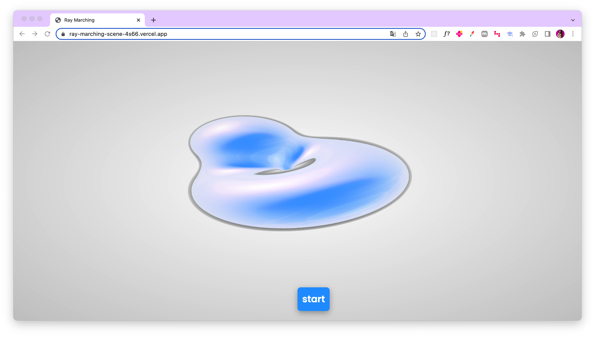
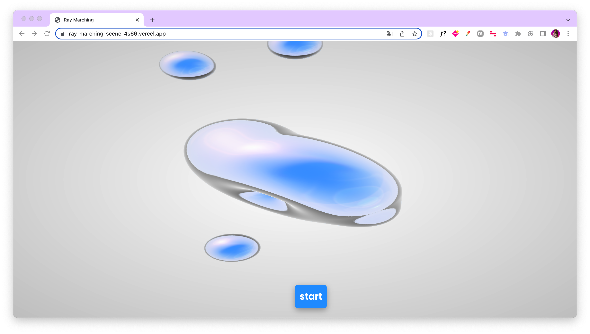

# Ray Marching Scene

[](https://opensource.org/licenses/MIT)
[](https://github.com/Fernanda-Kipper/ray-marching-scene/graphs/contributors)

[This project](https://ray-marching-scene.vercel.app/) is a simple 3D scene created using ray marching technique, implemented with [WebGL](https://webgl2fundamentals.org/) and [Three.js](https://threejs.org/). The goal of this project is to demonstrate the power and flexibility of ray marching technique in creating visually interesting 3D scenes. 

<p align="center">
    
    
</p>

### Ray Marching

Ray marching, also known as ray marching distance fields, is a technique used in computer graphics to render 3D scenes. It is a variation of ray tracing, where instead of tracing the path of rays of light from a camera to a surface, it iteratively steps along the ray direction and evaluates the distance function of the scene.


## Installation

To use this project, first ensure that you have Node.js and npm installed on your machine. Then, clone or download the repository to your local machine and navigate to the project directory in the command line. Run the following commands:


```bash
git clone https://github.com/Fernanda-Kipper/ray-marching-scene.git
cd ray-marching-scene
npm install
npm run start
```

## Contributing

Contributions to this project are welcome! 

If you find a bug or have an idea for an improvement, please create a new issue or submit a pull request.

## License

This project is licensed under the MIT License - see the [LICENSE](LICENSE) file for details.